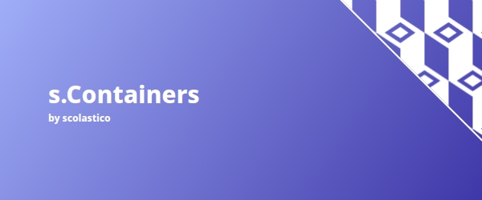

# 

## Info

### What is this?
A docker container library of *unmaintained* tool images

### Why?
I don't want to create for every small tool I need a special git repository.

### Backwards compatibility?
All containers are backwards-compatible and will be updated in a way that you can safely use
the `latest` tag of every container.

## Index
Click on the name for more infos.

### [`s.containers/cron`](./src/cron/README.md)
The cron container is for easy creation of cron jobs and intended for the usage inside a
docker compose stack. **It is not intended for the usage outside a docker compose stack.
For that use native cron!**

### [`s.Containers/web-cfg-editor`](./src/web-cfg-editor/README.md)
Easily edit config files in a web interface which can be secured with authentication.
The editor does not support the editing of binary files.

### [`s.containers/hastebin`](./src/hastebin/README.md)
A simple, lightweight pastebin that allows you to share snippets of code with others.
